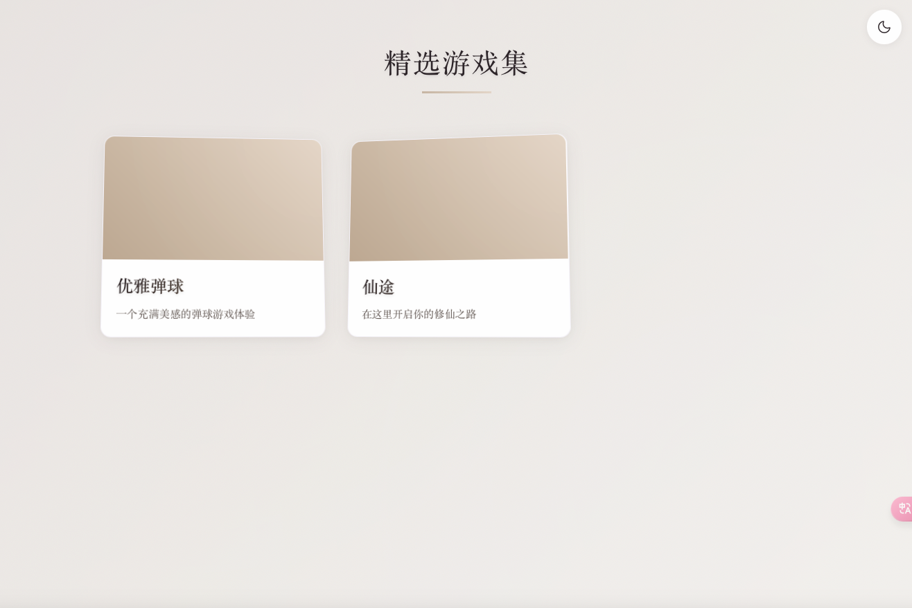

# Web Game Collection 网页游戏集合



一个优雅而现代的网页游戏合集平台，提供流畅的游戏体验和精致的视觉效果。

## 🔗 项目链接

- GitHub: [web-game-xuan](https://github.com/xiaoxuan654/web-game-xuan)
- 在线预览: [Live Demo](https://xiaoxuan654.github.io/web-game-xuan)

## ✨ 特性

- 🎮 优雅的游戏卡片展示
- 🌓 明暗主题切换
- 📱 完美的移动端适配
- 🎯 流畅的过渡动画
- 🖼️ 智能图片加载优化
- 🔄 平滑的状态切换
- 💫 精美的视觉效果
- 🔒 可靠的错误处理

## 🚀 技术栈

- 原生 JavaScript (ES6+)
- CSS3 高级特性
- HTML5 Canvas
- 响应式设计
- 渐进式增强

## 📦 项目结构

```
web-game2/
├── assets/
│   └── previews/         # 游戏预览图
│       ├── game1/
│       ├── game2/
│       └── placeholder.svg
├── data/
│   ├── games.json        # 游戏配置
│   └── games/           # 游戏源码
│       ├── game1/
│       └── game2/
├── styles.css           # 全局样式
├── main.js             # 主逻辑
└── index.html          # 入口文件
```

## 🛠️ 开发指南

### 环境要求

- 现代浏览器支持
- 本地开发服务器

### 安装和运行

1. 克隆仓库
```bash
git clone https://github.com/xiaoxuan654/web-game-xuan.git
cd web-game-xuan
```

2. 启动本地服务器
```bash
# 使用 Python 的简单 HTTP 服务器
python -m http.server 8080

# 或使用 Node.js 的 http-server
npx http-server
```

3. 访问 `http://localhost:8080`

## 🎮 添加新游戏

1. 在 `data/games/` 创建新游戏目录
2. 添加游戏预览图到 `assets/previews/`
3. 更新 `data/games.json` 配置

```json
{
  "games": [
    {
      "id": "your-game-id",
      "name": "游戏名称",
      "description": "游戏描述",
      "path": "/data/games/your-game-id/index.html",
      "preview": "./assets/previews/your-game-id/cover.jpg",
      "backgroundColor": "#F7F2ED"
    }
  ]
}
```

## 📱 移动端支持

- 触摸优化
- 响应式布局
- 性能优化
- 手势支持

## 🎨 主题定制

通过修改 CSS 变量轻松自定义主题：

```css
:root[data-theme="light"] {
    --bg-primary: #fcf9f6;
    --color-primary: #33292E;
    /* ...其他变量... */
}
```


## 🤝 贡献指南

1. Fork 项目
2. 创建您的特性分支 (`git checkout -b feature/AmazingFeature`)
3. 提交您的改动 (`git commit -m 'Add some AmazingFeature'`)
4. 推送到分支 (`git push origin feature/AmazingFeature`)
5. 打开一个 Pull Request

## 📄 许可证

MIT License © [xiaoxuan654](https://github.com/xiaoxuan654)

## 🙏 感谢

- [Font Awesome](https://fontawesome.com/) - 图标支持
- [Playfair Display](https://fonts.google.com/specimen/Playfair+Display) - 字体支持
