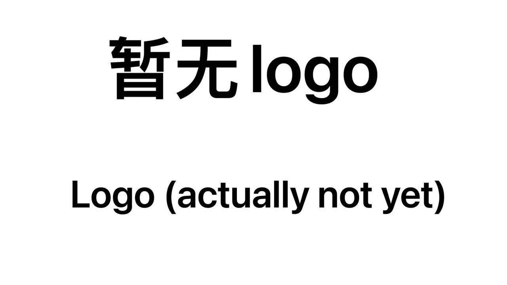

<p align="center">
  
</p>

<div align="center">

# Web Game Collection

🎮 A Modern Web Game Collection Platform | 一个优雅而现代的网页游戏合集平台

[](https://github.com/xiaoxuan654/web-game-xuan/stargazers)
[](https://github.com/xiaoxuan654/web-game-xuan/blob/main/LICENSE)
[](https://github.com/xiaoxuan654/web-game-xuan/issues)
[](https://github.com/xiaoxuan654/web-game-xuan/network)
[](https://github.com/xiaoxuan654/web-game-xuan/releases)

[Live Demo](https://game.xiaoxuan654.top/) | [中文](./README.md) | [Report Issue](https://github.com/xiaoxuan654/web-game-xuan/issues)

</div>

## 📖 Introduction

Web Game Collection is a modern game platform developed using pure native technology stack, providing smooth gaming experience and exquisite visual effects. It supports multiple themes, responsive layout, touch optimization, and more features.

## 🚀 Features

- 🎮 Elegant game card display
- 🌓 Light/Dark theme switching
- 📱 Perfect mobile adaptation
- 🎯 Smooth transitions
- 🖼️ Smart image loading
- 🔄 Seamless state transitions
- 💫 Beautiful visual effects
- 🔒 Reliable error handling

## 📦 Installation

```bash
# Clone the repository
git clone https://github.com/xiaoxuan654/web-game-xuan.git

# Enter project directory
cd web-game-xuan

# Start development server
python -m http.server 8080
# or
npx http-server
```

## 🎮 Usage

Visit `http://localhost:8080` to start:

1. Click game cards to enter corresponding games
2. Use theme toggle button to change appearance
3. Supports touch and keyboard controls

## 📦 Project Structure

```
web-game-xuan/
├── assets/
│   └── previews/         # Game previews
│       ├── game1/
│       ├── game2/
│       └── placeholder.svg
├── data/
│   ├── games.json        # Game configuration
│   └── games/           # Game source code
│       ├── game1/
│       └── game2/
├── styles.css           # Global styles
├── main.js             # Main logic
└── index.html          # Entry file
```

## 🔧 Development Guide

### Requirements

- Modern browser support
- Local development server

### Add New Game

1. Create new game directory in `data/games/`
2. Add preview image to `assets/previews/`
3. Update `data/games.json` configuration

```json
{
  "games": [
    {
      "id": "your-game-id",
      "name": "Game Name",
      "description": "Game Description",
      "path": "/data/games/your-game-id/index.html",
      "preview": "./assets/previews/your-game-id/cover.jpg",
      "backgroundColor": "#F7F2ED"
    }
  ]
}
```

## 📱 Mobile Support

- Touch optimization
- Responsive layout
- Performance optimization
- Gesture support

## 🎨 Theme Customization

Easily customize themes by modifying CSS variables:

```css
:root[data-theme="light"] {
    --bg-primary: #fcf9f6;
    --color-primary: #33292E;
    /* ...other variables... */
}
```

## 🤝 Contributing

Contributions are very welcome! [Submit an issue](https://github.com/xiaoxuan654/web-game-xuan/issues/new) or create a Pull Request.

## 🌟 Star History

[](https://star-history.com/#xiaoxuan654/web-game-xuan&Date)

## 📄 License

This project is licensed under the MIT License - see the [LICENSE](LICENSE) file for details.

## 👏 Acknowledgments

- [Font Awesome](https://fontawesome.com/) - Icon support
- [Playfair Display](https://fonts.google.com/specimen/Playfair+Display) - Font support

---

> GitHub [@xiaoxuan654](https://github.com/xiaoxuan654) · Telegram [@xiaoxuan_654](https://t.me/xiaoxuan_654)
